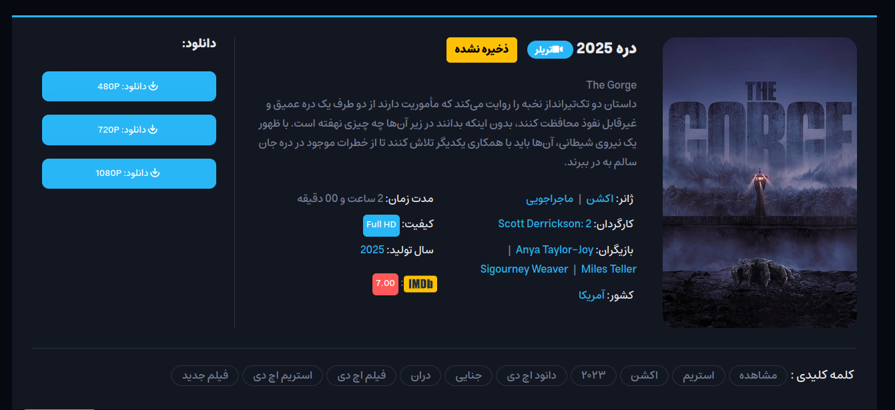
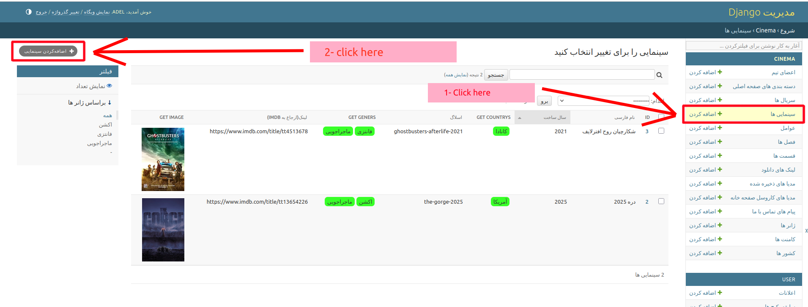

# Movie
The *movie* has a *link* field. *links* is a ManyToManyField and can contain multiple download links and other data.

## Add movie:(movie details):

this is a example of movie details page.

**To add a new movie: Go**:

Admin panel >> Movie >> add movie:

