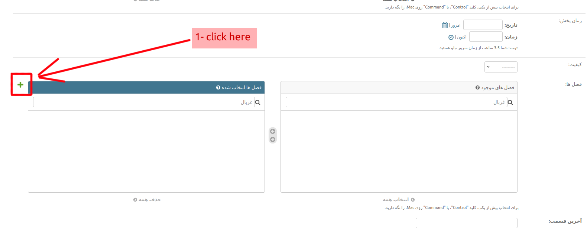
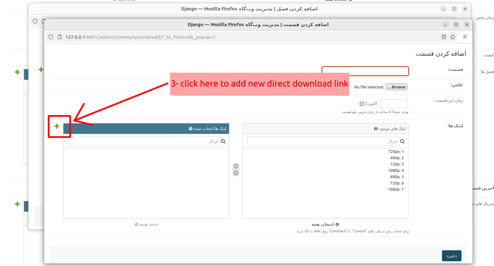
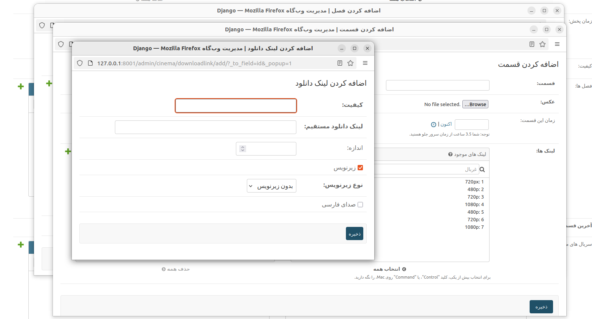

# Serial
The *Serial* has a *section* field. *Section* is a ManyToManyField and can add multiple *episodes* and other data.
each *episode* can contains many *links* like *Movie*.

## add Serial: (serial detils):

this is a example of serial details page.

**To add a new serial: Go:**

Admin panel >> Serial >> add serial:
Add a new section

Add a new episode

Add a new download link

confirm download link information

