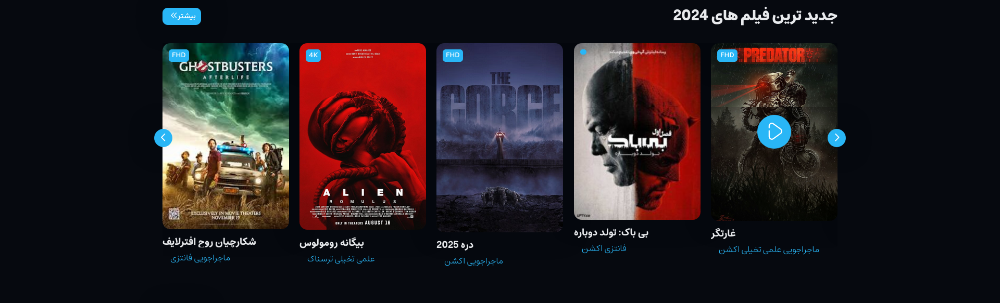
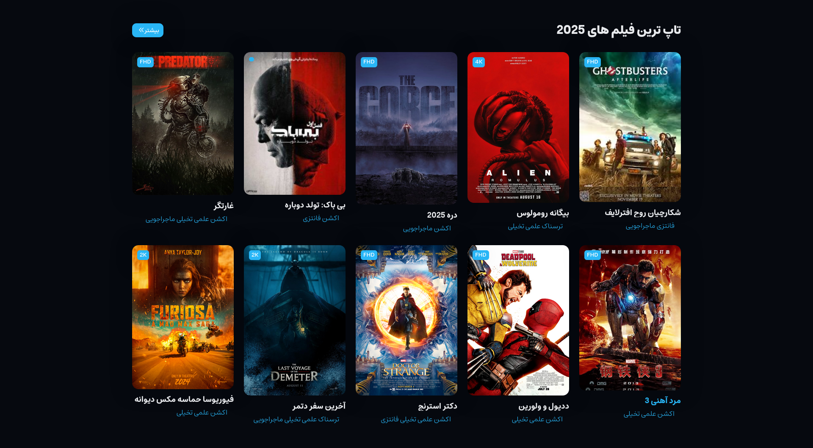
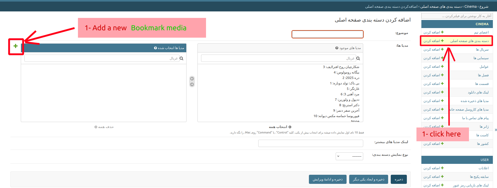
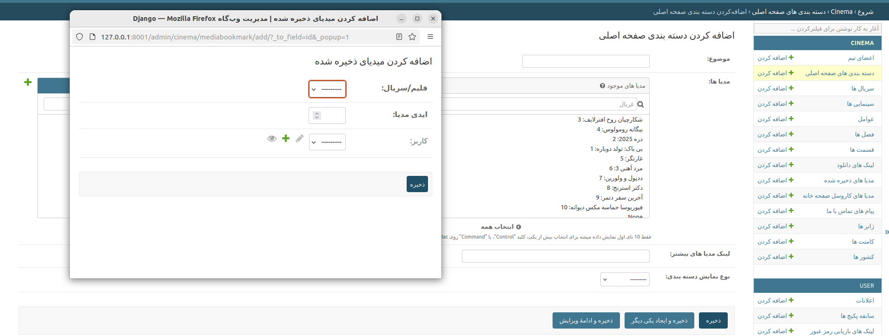

## Home categorys(Unlimited categorys)

horizontal

vertical

### Horizontal or vertical

Each category can be *Horizontal* or *Vertical*.
!!! info
    Each *horizontal* category can contain many movies or series but only displays the first 8 media items.

### Add a new category:
Admin panel >> Main Page Category >> add Main Page Category

!!! note
    Any media that falls into these categories is an instance of bookmark media. (First we need to create a bookmark media and then use this instance in a category.)

#### 1 add a category:

#### 2 complete the information

!!! note
    **media_id** or **آیدی مدیا** or **media id** is id of serial or movie.
    chooce **Media type** or **نوع مدیا** (**serial** or **movie**)

#### 2 media id:

