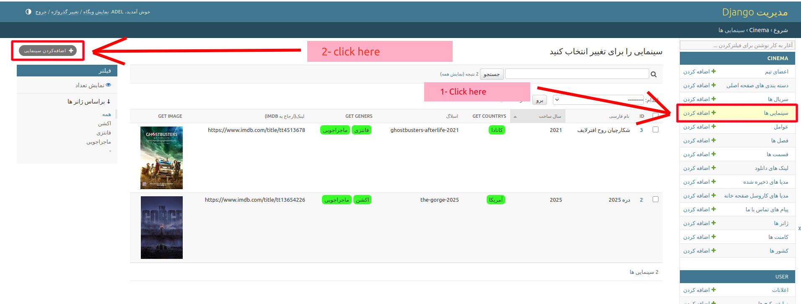

# فیلم

مدل `Movie(فیلم)` دارای یک فیلد `Link(لینک)` است. فیلد `(لینک‌ها)links` از نوع `ManyToManyField` است و می‌تواند شامل چندین لینک دانلود و اطلاعات دیگر باشد.

## افزودن سینمایی: (جزئیات سینمایی):

  
این یک نمونه از صفحه جزئیات سینمایی است.

**برای افزودن یک سینمایی جدید، به مسیر زیر بروید**:

`پنل مدیریت >> سینمایی >> افزودن سینمایی`:

