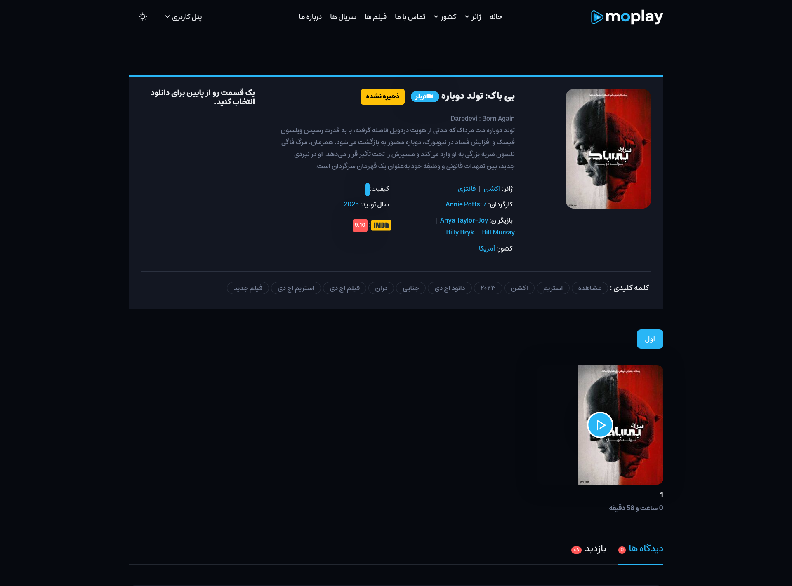
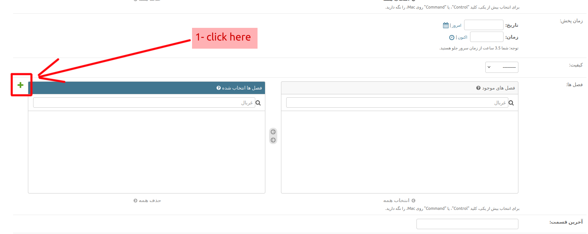
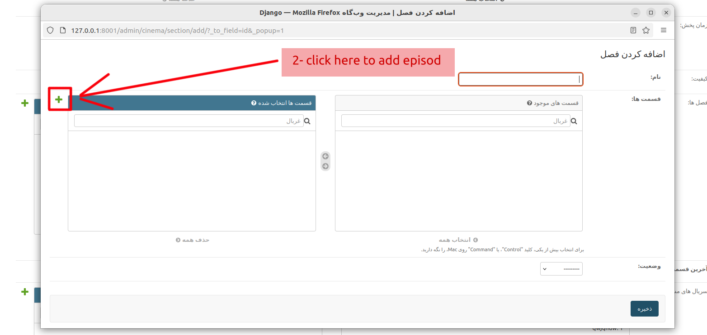
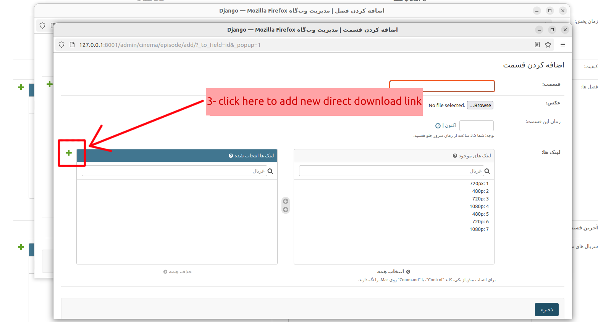
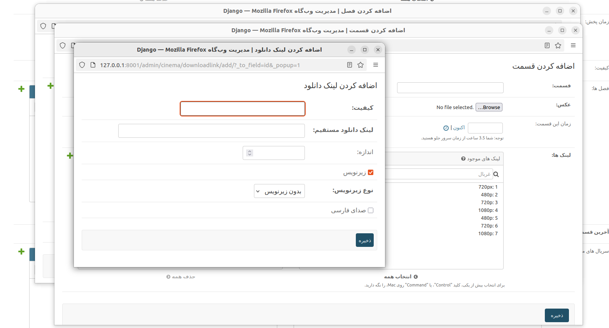

# سریال

`Serial(سریال)` دارای فیلد `section(فصل)` است. فیلد `فصل` از نوع `ManyToManyField` می‌باشد و می‌تواند شامل چندین `فصل ` و اطلاعات دیگر باشد.  
هر `فصل` دارای فیلد `episode(قسمتها)` است. هر `episode` دارای فیلد `links` است که میتونه شامل لینک دانلود مستقیم و موارد دیگه باشه

## افزودن سریال: (جزئیات سریال):

  
این یک نمونه از صفحه جزئیات سریال است.

**برای افزودن یک سریال جدید، مسیر زیر را دنبال کنید**:

`پنل مدیریت >> سریال >> افزودن سریال`

افزودن یک فصل جدید:  

افزودن یک قسمت جدید:  

افزودن یک لینک دانلود جدید:  

کامل کردن اطلاعات لینک دانلود:  

