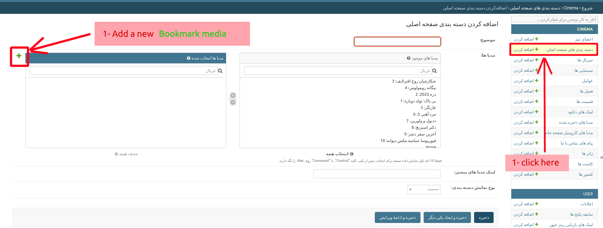
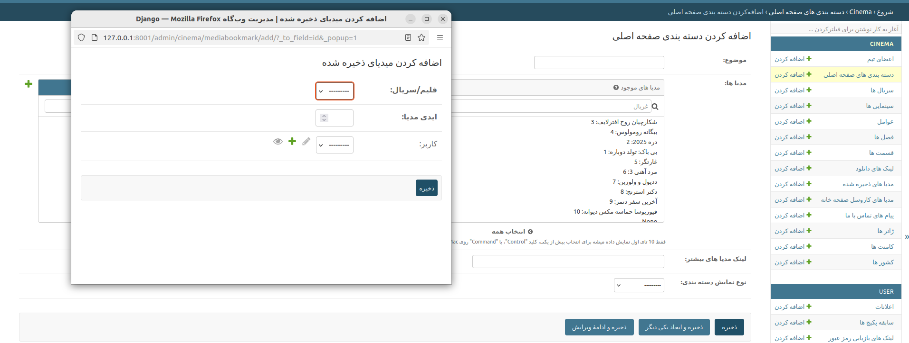
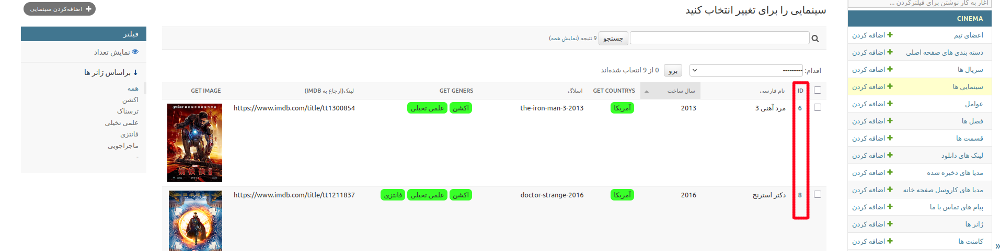

# دسته بندی های صفحه خانه(نامحدود)

افقی

عمودی

### افقی یا عمودی

هر دسته بندی میتونه `افقی` یا `عمودی` باشه
!!! info "نحوه نمایش دسته بندی افقی"
    هر دسته بندی افقی میتونه شامل تعداد زیادی فیلم و سریال باشه اما فقط ۸ تای انها در یک ردیف با اسکرول دیده میشه.

### افزودن یه دسته بندی جدید:
پنل ادمین >> دسته بندی صفحه اصلی >> افزودن دسته بندی صفحه اصلی

!!! note "پیشنیاز ساخت دسته بندی ها"
    هر رسانه‌ای که در این دسته‌ها قرار بگیرد، یک نمونه از **Bookmark Media** محسوب می‌شود.  
    (ابتدا باید یک **Bookmark Media** ایجاد کنیم و سپس از این نمونه در یک دسته‌بندی استفاده کنیم.)

#### 1 افزودن دسته بندی:

#### 2 تکمیل اطلاعات

!!! note "مدیا ایدی"
    **media_id** یا **آیدی مدیا** یا **media id** ایدی فیلم یا سریال است.
    **Media type** یا **نوع مدیا** میتونه (**serial** یا **movie**) باشه

#### 2 پیدا کردن مدیا ایدی:

